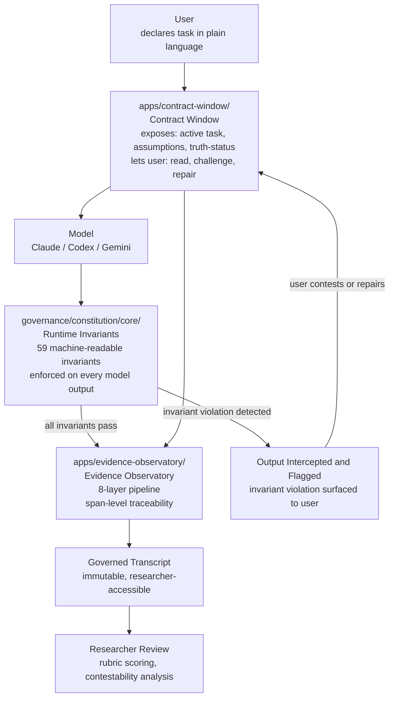
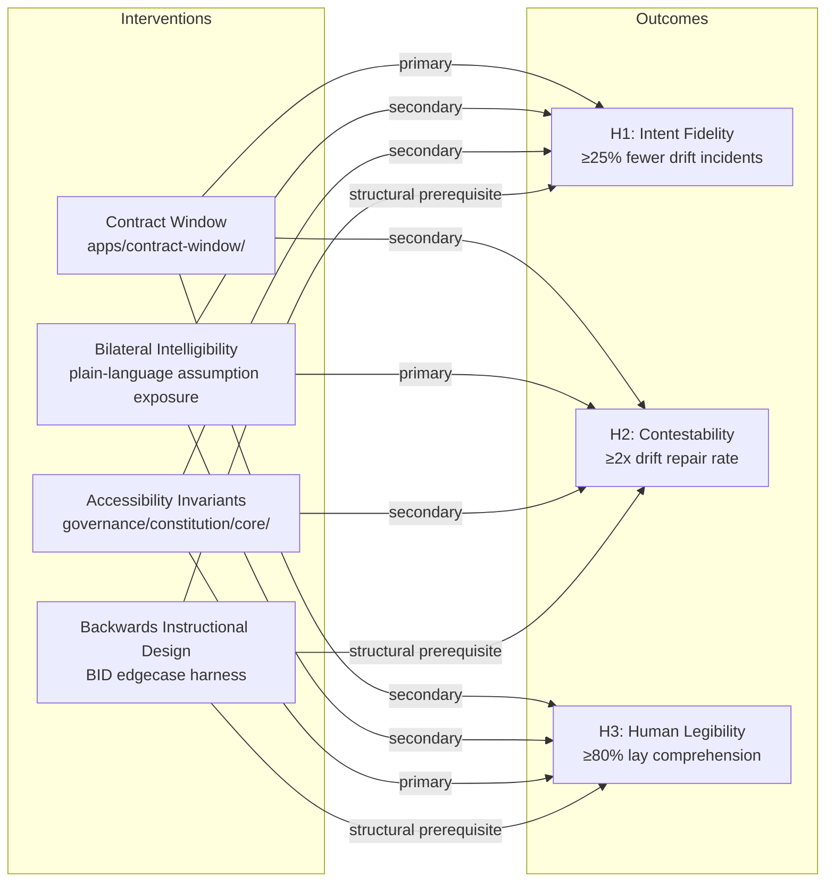

# The Living Constitution

**A constitutional governance-as-code research apparatus used across applied AI safety projects to study model behavior, runtime governance, and human-AI interaction under real task pressure — including interface-level contestability, misalignment detection, vulnerable-user safety, consent-aware agent oversight, and evidence-producing research workflows.**

For a concise reviewer-facing product overview, see [TLC Reviewer PRD](docs/product/TLC_REVIEWER_PRD.md).

---

## Two reviewer paths

This repository serves two distinct reviewer purposes. Choose the path that matches why you are here.

**[Research Path](docs/front-door/TWO_REVIEWER_PATHS.md#research-path)** — Evaluate TLC as a hypothesis-driven AI safety research apparatus. Covers H1 (Intent Fidelity), H2 (Bilateral Repair), H3 (Accessibility), Contract Window design, Evidence Observatory, and the honest unverified status of each hypothesis.

**[Build Path](docs/front-door/TWO_REVIEWER_PATHS.md#build-path)** — Evaluate TLC as a runnable constitutional governance-as-code prototype. Covers C-RSP build contracts, runtime invariants, Contract Window reference implementation, verification evidence, and prototype-grade status declaration.

Full routing guide: [docs/front-door/TWO_REVIEWER_PATHS.md](docs/front-door/TWO_REVIEWER_PATHS.md)

Reviewer guide by role (Research / Software Engineer / Product / Safety-Governance / Skeptic): [docs/review/REVIEWER_GUIDE.md](docs/review/REVIEWER_GUIDE.md)

---

---

## What this is

The Living Constitution (TLC) is a constitutional governance substrate and research apparatus for studying whether AI systems can be made governable, contestable, and legible across different research contexts. Its tools and project folders are not presented as ordinary product-development surfaces; they function as research contexts, instrumentation layers, applied testbeds, or governed project records used to observe model behavior, expose failure modes, and preserve evidence.

Regardless of the research context, TLC exposes the active task agreement, the system's current assumptions, and its truth-status to the user throughout the interaction — and lets the user read, challenge, and repair them in plain language.

It is built to test research questions about runtime governance, model behavior, human legibility, and contestability, while producing instruments other researchers can reuse regardless of what TLC itself shows.

---

## Why this exists

Long-context AI interactions are now the default. A million-token context window is not safer than an eight-thousand-token one if the user cannot tell when the system has silently drifted from the task they originally asked for. Most safety work targets the model in isolation. TLC targets the interaction environment around the model — the interface, task contract, assumptions, truth-status, governance checks, and evidence trail — because that is where model behavior becomes consequential to the people using or affected by the system.

This repo is therefore not only a product prototype. It is a research control surface: a place where model behavior can be observed under governed conditions, where misalignment can be surfaced or replicated in bounded applied settings, and where downstream projects such as MadMall/MADMall can test related questions in healthcare-adjacent or vulnerable-user scenarios without collapsing the whole effort into product development.

The audiences this is built for, by name:

- AI safety researchers interested in runtime, interactional safety interventions.
- Interpretability researchers looking for an interface-level analog to feature-level work.
- Accessibility researchers and disability-led designers studying neurodivergent users of AI.
- Practitioners building long-context agentic systems who need their users to be able to see what the agent is doing.

---

## The research question

> Do a persistent Contract Window, bilateral intelligibility, and accessibility-grade runtime invariants improve intent fidelity, contestability, and human legibility?

Each term has an operational definition in [PROPOSAL.md](./PROPOSAL.md#d-construct-definitions-operational). They are not metaphors.

---

## The author's claim

I do not believe these interventions will be a clean win on every measure. I think the Contract Window will help most on long sessions and may slow short ones down. I think bilateral intelligibility will improve contestability but may surface assumptions users would rather not have to read. I think accessibility-grade invariants will help lay readers and may frustrate expert users who experience them as friction.

What I am confident about: these are *measurable* claims with *falsifiable* predictions, and the instruments built to test them — the rubric, the contestability funnel, the lay comprehension test — are useful even if every intervention fails. That is the floor. The ceiling is that one or more of them works, and we have a transferable pattern for runtime governance other systems can adopt.

I am autistic and schizophrenic. The Contract Window started as something I needed. The research question is whether other people benefit from it too.

---

## What you'll find in this repo

### Governance truth surfaces

| File | Purpose |
|---|---|
| [`STATUS.json`](./STATUS.json) | Authoritative machine-readable operational status — truth anchor, review state, tip-state truth |
| [`STATUS.md`](./STATUS.md) | Human-readable mirror of STATUS.json, regenerated deterministically |
| [`MASTER_PROJECT_INVENTORY.md`](./MASTER_PROJECT_INVENTORY.md) | Full map of governed projects, overlays, repo paths, and known anomalies |
| [`THE_LIVING_CONSTITUTION.md`](./THE_LIVING_CONSTITUTION.md) | Constitutional specification — Articles I–V, agent powers, amendment logic |

### Research artifacts

| Item | Description | Status |
|---|---|---|
| [`PROPOSAL.md`](./PROPOSAL.md) | Full Anthropic Safety Research Fellow proposal | working |
| [`apps/contract-window/`](./apps/contract-window) | Contract Window reference implementation | prototype |
| [`apps/evidence-observatory/`](./apps/evidence-observatory) | 8-layer evidence pipeline that promotes raw interactions into governed transcripts | working |
| [`experiments/constitutional_eval_runs/constitutional-eval-edgecase-harness-v2-20260423T071801Z/`](./experiments/constitutional_eval_runs/constitutional-eval-edgecase-harness-v2-20260423T071801Z) | Backwards Instructional Design (BID) edgecase harness, first run | in-progress |
| [`schemas/`](./schemas) | Schema set: session state, contracts, invariants, adjudications | working |
| [`docs/vt/`](./docs/vt) | Verification & Truth status reporting spec | working |
| [`benchmarks/`](./benchmarks) | Drift-seeded long-session benchmark (in construction) | in-progress |

### System Architecture

The system connects four components: the Contract Window (user-facing), the Model (any frontier LLM), the Runtime Invariants (governance enforcement), and the Evidence Observatory (researcher-facing). Data flows from user intent through the Contract Window into the model, through governance checks, and into a permanent evidence record.



**Reading this diagram without sight:** The user declares a task in plain language inside apps/contract-window, which exposes the active task agreement, current assumptions, and truth-status. The Contract Window sends the task to the Model, which can be Claude, Codex, or Gemini. Every model output passes through the Runtime Invariants in governance/constitution/core, which enforces 59 machine-readable invariants. If all invariants pass, the output is logged to apps/evidence-observatory. If an invariant violation is detected, the output is intercepted and flagged, and the user is shown the violation inside the Contract Window. The user can contest or repair the task. All session data — from the Contract Window and from invariant checks — flows into the Evidence Observatory, which promotes the session to a Governed Transcript with span-level traceability. Researchers access Governed Transcripts for rubric scoring and contestability analysis.

---

## How to run it

```bash
# 1. Clone
git clone https://github.com/coreyalejandro/the-living-constitution.git
cd the-living-constitution

# 2. Install (Node 20+, pnpm 9+)
pnpm install

# 3. Set provider keys (at least one)
cp .env.example .env.local
# edit .env.local and set ANTHROPIC_API_KEY (and/or OPENAI_API_KEY, GOOGLE_API_KEY)

# 4. Run the Contract Window dev server
pnpm dev:contract-window

# 5. Open http://localhost:3000
```

**Expected output:** A chat interface with a persistent Contract Window pinned to the right side. Type a task. The Contract Window populates with declared task, system understanding, constraints, and truth-status. Every model output that violates an active invariant is intercepted and flagged.

**Most likely failure:** missing or invalid `ANTHROPIC_API_KEY`. Check `.env.local` and confirm the key is present and not surrounded by quotes.

---

## The research frame (short)

Three hypotheses, each falsifiable:

- **H1.** Persistent Contract Window → ≥25% fewer intent-drift incidents in long sessions.
- **H2.** Bilateral intelligibility → ≥2× rate of successful drift repair by users.
- **H3.** Accessibility-grade invariants → ≥80% lay-reader comprehension of session transcripts (vs. ≤50% baseline).

A fourth construct — **Backwards Instructional Design** — is integrated as an experimental condition rather than a separate hypothesis. See [PROPOSAL.md §F](./PROPOSAL.md#f-experimental-design).

The diagram below shows how the four interventions map to the three hypothesis outcomes. Each arrow represents a primary (solid) relationship; secondary relationships run through all three outcomes from every intervention.



**Reading this diagram without sight:** Four interventions are listed on the left: Contract Window (apps/contract-window/), Bilateral Intelligibility, Accessibility Invariants (governance/constitution/core/), and Backwards Instructional Design. Three hypothesis outcomes are listed on the right: H1 Intent Fidelity targeting at least 25 percent fewer drift incidents, H2 Contestability targeting at least 2 times the drift repair rate, and H3 Human Legibility targeting at least 80 percent lay comprehension. Contract Window has a primary relationship to H1 and secondary relationships to H2 and H3. Bilateral Intelligibility has a secondary relationship to H1, primary to H2, secondary to H3. Accessibility Invariants has secondary to H1 and H2, primary to H3. Backwards Instructional Design is a structural prerequisite for all three outcomes — it enables the other interventions rather than being independently tested.

### Intervention × outcome matrix

| Intervention | Intent fidelity | Contestability | Human legibility |
|---|---|---|---|
| Contract Window | primary | secondary | secondary |
| Bilateral intelligibility | secondary | primary | secondary |
| Accessibility invariants | secondary | secondary | primary |
| Backwards Instructional Design | structural prerequisite | structural prerequisite | structural prerequisite |

---

## Prior work trajectory

- **ClarityAI** — rubric-operationalized scoring; first pattern of "make the standard explicit, then test the system against it." Direct ancestor of the rubric used to score intent fidelity.
- **Instructional Integrity work** — early evaluation of whether AI-generated explanations preserve learner understanding. Direct ancestor of the lay legibility test.
- **MTADF (Misalignment Taxonomy & Automated Detection Framework)** — earlier proposal asking *can misalignment be detected?* The current work asks the next question: *can the interaction environment be redesigned so misalignment is prevented, surfaced earlier, or made contestable?*
- **PROACTIVE** — constitutional AI safety framework with nine principles, six invariants, and the original Contract Window mechanism. The runtime invariants in this repo are descendants of that work.

---

## Anthropic alignment

- **Constitutional AI** (Bai et al., 2022): TLC moves the constitutional surface from training time to runtime, and from internal to interface-visible.
- **Collective Constitutional AI** (Anthropic, 2024): TLC asks whether enforcement of collectively-elicited principles can be made bilaterally legible to the people they protect.
- **Mechanistic interpretability / Scaling Monosemanticity**: TLC is an interface-level analog — surfacing *interactional* features (task contracts, assumptions, truth-status) the way feature-level work surfaces internal model features.
- **Anthropic Fellows Program** scope explicitly includes empirical AI safety, scalable oversight, and AI control. This work is empirical, runs on existing infrastructure, and produces transferable instruments regardless of the result.

---

## V&T (honest status)

**Verified:**
- Contract Window prototype renders persistent state and is addressable across a session.
- Evidence Observatory pipeline produces governed transcripts with span-level traceability.
- BID edgecase harness has produced a first experiment run with logged outputs.
- Schema set validates on the example sessions in `schemas/examples/`.

**Unverified:**
- The three primary hypotheses (H1–H3). The experiment described in `PROPOSAL.md` has not yet been run at the powered sample size.
- The lay comprehension instrument is new and needs its own validation work.
- Inter-rater reliability targets (κ ≥ 0.7) are aspirational until rater training is complete.

**Challenged (where I doubt my own claims):**
- Whether the Contract Window's effect, if any, is structural or merely attentional (does it work because it externalizes state, or because it reminds the user to pay attention?). The single-intervention conditions partially decompose this but residual confound is likely.
- Whether BID is an independent intervention or a prerequisite design discipline for the other three.
- Whether interface friction is a feature for some users and an obstacle for others.

**Functional status:** Prototype-grade. Suitable as a research apparatus. Not suitable as a production safety layer for deployed systems without further hardening.

---

## What to do next

Three options, ranked by depth.

1. **Read** — Start with [`PROPOSAL.md`](https://github.com/coreyalejandro/crsp-afs-2026/blob/master/proposal/final_proposal.md). The construct definitions in §D are the core of the work.
2. **Run** — Follow the *How to run it* section above and put the Contract Window through a 50-turn task. Watch what it surfaces.
3. **Contribute** — The most valuable open contributions right now are: (a) lay-rater pool recruitment for the legibility test, (b) drift-seeding scenarios for the benchmark, (c) replications of the BID harness against other model providers.
