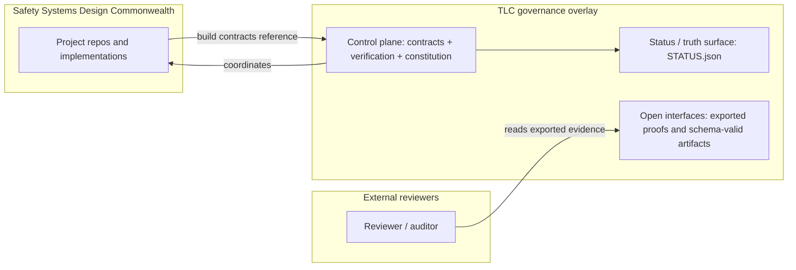
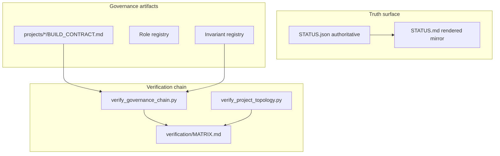
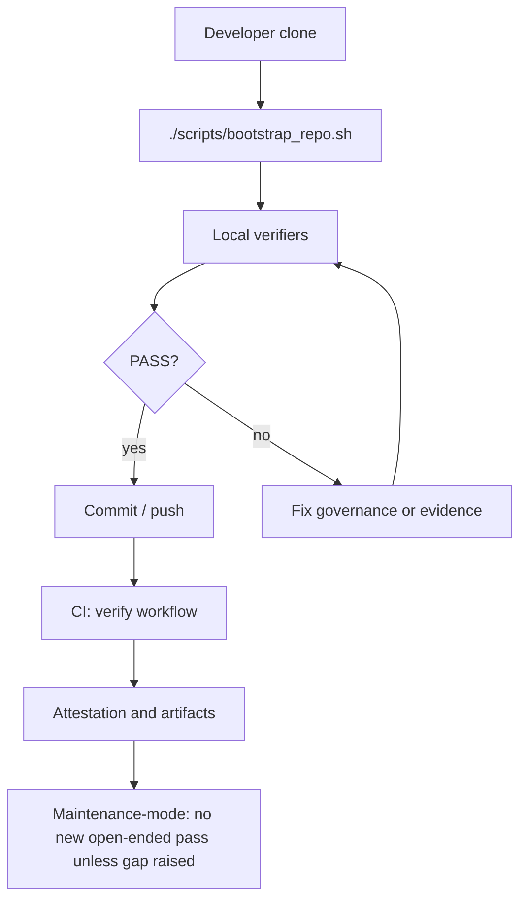
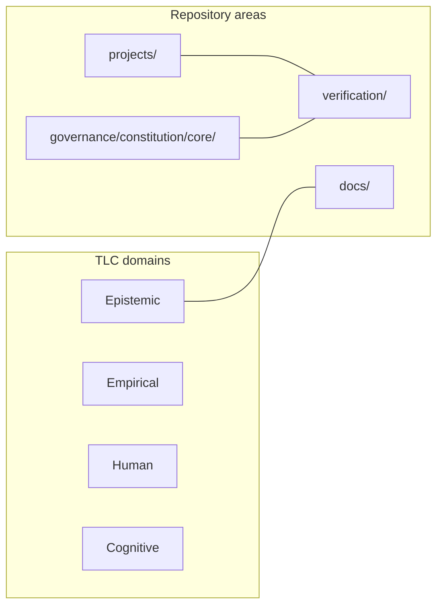
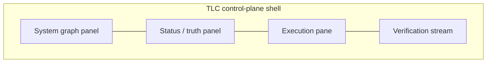

# The Living Constitution

**A self-governing, self-healing governance operating system that operationalizes Anthropic's Constitutional AI at build time, runtime, and recovery time.**

[](https://github.com/coreyalejandro/the-living-constitution/actions/workflows/verify.yml)


---

## The 6-Second Version

Most AI safety ideas stop at training time.

TLC carries the constitution into **execution**:

- Invariants become runtime checks.
- Build contracts become enforceable constraints.
- Evidence becomes mandatory before claims.

**Governance here is executable, not decorative.**

TLC also provides an invariants-based method for operationalizing other governance documents, not just its own constitution.

---

## Why people keep reading this repo

This repository answers one hard question:

**How do you stop agentic systems from looking aligned while drifting in practice?**

TLC's answer is operational:

- Treat governance as a compiler for power.
- Treat claims as invalid until backed by evidence.
- Treat recovery as a first-class safety feature, not a postmortem.

---

## What this repo actually is

This is a governance and research control plane, not a monolithic product app.

It contains:

- Constitutional specification and amendment logic.
- C-RSP (Constitutionnally-Regulated Single Pass) executable prompt contracts and governance artifacts.
- Verification automation and truth surfaces.
- Cross-project evidence ledgers for claims.

Start with these files:

- [`THE_LIVING_CONSTITUTION.md`](THE_LIVING_CONSTITUTION.md) - constitutional source text.
- [`governance/README.md`](governance/README.md) - governance model and artifacts.
- [`verification/MATRIX.md`](verification/MATRIX.md) - claim-to-evidence ledger.
- [`STATUS.json`](STATUS.json) - authoritative machine status surface.
- [`docs/operations/VERIFY.md`](docs/operations/VERIFY.md) - operator verification procedure.

---

## Signature mechanisms

### V&T statement (truth discipline)

Every serious output is expected to include explicit truth boundaries:

- What exists.
- What was verified.
- What is not being claimed.
- What remains unverified.

This makes omission and over-claiming easier to detect and audit.

### C-RSP (Constitutionally-Regulated Single Pass)

A governed build contract model that constrains implementation against explicit acceptance criteria and evidence expectations.

### Invariants-based operationalization method (for other governance docs)

TLC can operationalize governance documents outside this repository by compiling their intent into explicit invariants:

1. Extract normative intent from source prompts or policy text.
2. Convert each intent statement into machine-checkable invariants (`MUST`, `MUST NOT`, evidence requirement, failure signal).
3. Bind invariants to runtime enforcement points (pre-action, post-action, recovery-path checks).
4. Define verifier scripts and expected pass/fail outputs.
5. Write evidence outputs to a deterministic truth surface (`STATUS.json`, `verification/MATRIX.md`, run artifacts).

This is the method for turning governance prompts into executable controls instead of advisory text.

Evidence artifacts for this method:

- `verification/prompt_operationalization_inputs.json`
- `verification/prompt_operationalization_report.json`
- `verification/prompt_operationalization_report.md`
- `scripts/evaluate_governance_prompts.py`

### Anthropic Constitutional AI operationalization

TLC is explicitly designed as a runtime implementation layer for Anthropic Constitutional AI:

- Constitutional principles are transformed into enforceable invariants.
- Tool execution is governed by those invariants and contract boundaries.
- Verification evidence is required before completion claims.

For prompt-level governance candidates under evaluation, see your Claude Workbench prompt set: [Claude Workbench](https://platform.claude.com/workbench/5332b02a-81ab-4979-af9a-6944c02b0e40?tab=evaluate).

### Guardian runtime

`src/guardian.py` is the enforcement surface for constitutional checks, health checks, and invariant handling in runtime workflows.

---

## Fast start

```bash
# 1) Bootstrap repo prerequisites
./scripts/bootstrap_repo.sh

# 2) Run guardian health check
python3 src/guardian.py --health-check

# 3) Run core verification flow
python3 scripts/verify_document_constitution.py --root .
python3 scripts/verify_project_topology.py --root . --with-governance
python3 scripts/verify_governance_chain.py --root .
```

Then read:

- `docs/instructions/FIRST_RUN.md`
- `docs/operations/BOOTSTRAP.md`
- `docs/operations/VERIFY.md`
- `docs/operations/ROLLBACK.md`
- `docs/HELP.md`

---

## Honest status boundaries

What is true right now:

- This repo is a governance overlay with executable verification logic.
- Most downstream product implementations live in sibling repos/submodules.
- `STATUS.json` is authoritative; README is orientation, not canonical status.

If you need current state, read:

- `STATUS.json` (source of truth)
- `STATUS.md` (human mirror)

---

## Architecture lens: Constitution as compiler

| Layer | TLC Component | Analog |
| --- | --- | --- |
| Type specification | `THE_LIVING_CONSTITUTION.md` + governance registries | Language + type declarations |
| Runtime enforcement | `src/guardian.py` | Runtime / VM checks |
| Static governance checks | verification scripts and contract checks | Linting/static analysis |
| Evidence surface | `STATUS.json`, `verification/MATRIX.md` | Debugger + telemetry |

---

## System diagrams

Five canonical diagrams for the repo. Sources live in `docs/front-door/diagram-sources/`.

### D1 — System context



### D2 — Control-plane architecture



### D3 — Execution loop



### D4 — System graph



### D5 — UI layout



---

## Documentation map

- `THE_LIVING_CONSTITUTION.md` - preamble and articles.
- `docs/INDEX.md` - documentation index.
- `docs/operations/` - bootstrap, verify, recovery procedures.
- `governance/` - live governance artifacts.
- `projects/` - project-level overlays and contracts.
- `verification/` - evidence and claim mapping.

---

## License

Root license file is not declared in this repository yet; check project-level licenses where present.
